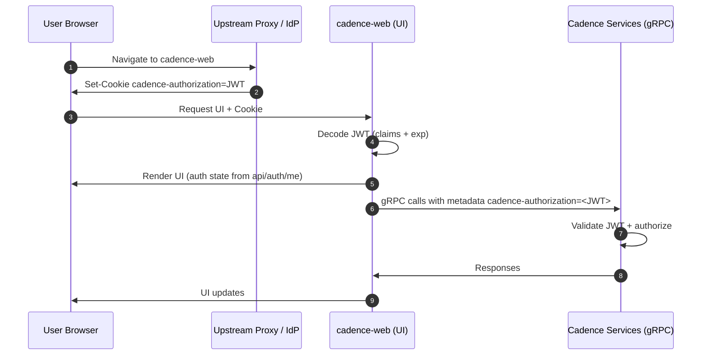

# Design Doc: Domain-based access control for the UI (alias: Role based Cadence-web)

## Introduction
Cadence does not provide built-in access control for its Web. As a result, there is no mechanism for authorized users to interact with the UI.
While it’s technically possible to modify the code and rebuild the client, this approach is inconvenient and not practical for most users.
Cadence handles most access control on the backend. Each API endpoint is associated with a specific permission level (admin, write, read). 
A domain defines who can read or write by specifying groups in its metadata (e.g., WRITE_GROUPS, READ_GROUPS).

> Note: This document describes one possible access model.
> The `READ_GROUPS` / `WRITE_GROUPS` examples are illustrative, not required.
> Access resolution stays behind dynamic config resolvers such as `DOMAIN_ACCESS`, so deployments can use a different restriction model.

This means authorization is enforced server-side. So, it is necessary to issue a JWT that contains the user’s group memberships. 
Cadence then checks those groups against the domain’s allowed groups to determine access. For example:
```

Domain Setup

name: "finance-payments"

READ_GROUPS: viewer

WRITE_GROUPS: editor

Meaning:

viewer → can READ

editor → can READ + WRITE

User JWT Examples

User 1: viewer = read only

{

"name": "user1",

"groups": "viewer"

}

User 2: editor = read + write

{

"name": "user2",

"groups": "editor"

}

```

We can have those roles respectively:

* Cadence admin - Full access to all domains (read and write) - a superuser role with no restrictions.
We can have in JWT Claims the admin:true without adding any group (+ it aligns with backend validation);
* Domain admin – Full access (read/write) only to specific authorized domain(s) - the admin value is false, and groups must match the domain’s WRITE_GROUPS/READ_GROUPS metadata.
* Domain Viewer - Read-only access to specific authorized domain(s). They can view workflows and histories in those domains but
cannot mutate state (no workflow start/terminate, etc.) – the admin value is false, and groups must match the domain’s READ_GROUPS metadata.
* Public (a user without any authorization other than access to Cadence-web) - when auth is enabled, unauthenticated users are denied access.

The scope: add UI-layer awareness of Cadence backend auth without inventing new policy surfaces. The Web should only propagate tokens, 
reflect capabilities in UX (enable/disable/hide). Backend remains the source of truth; Cadence authorizes every GRPC call.

Cadence-Web doesn’t implement its own auth; it piggybacks on Cadence’s JWT-based authorization:

Token source: An upstream identity provider issues JWTs containing Cadence-specific claims (groups or admin flag).
The Cadence server validates the token signature against a configured public key/algorithm and enforces access per endpoint/domain based on those claims and domain metadata.


UI enforcement:

* Login button to paste JWT token.
* Workflow actions are enabled/disabled from server-side config resolution, with unauthorized actions surfaced in the UI.
* Unauthenticated: when auth is enabled, access is denied.

Configurable auth: If turned off, Cadence-Web behaves as no login required, with full access as before.

Additional feature:

• Each authenticated user is associated with one or more roles (from the four above). For example, a user could be a Domain admin for domain X and a Domain Viewer for domain Y.

## Goals

Provide an optional Role-Based Access Control (RBAC) mode for Cadence-Web that:

* Integrates with Cadence’s existing JWT-based authorization.
* Reflects user permissions in the UI.
* Improves UX by hiding or disabling unauthorized actions.
* Remains simple to deploy. 
* Supports common enterprise SSO/proxy setups.
* Supports local development.

### Non-Goals

* Cadence-Web does not implement full authentication or identity management.
* Cadence-Web does not validate JWT signatures.
* Cadence-Web does not introduce new authorization policies.
* Cadence-Web is not an OAuth/OIDC provider.

Authentication and authorization remain primarily external responsibilities.

## High-level design: UI auth lifecycle

Cadence-web authenticates using a HttpOnly cookie containing a raw JWT.
The server reads this cookie and forwards the token to Cadence services. 
The client UI accesses the authentication state via an API endpoint.

Lifecycle (simplified):

1. Token issuance
   - Upstream proxy/IdP sets `cadence-authorization` cookie on the cadence-web origin or
   - Manual login via the "Login with JWT" button (mostly for development reasons).
2. Session state
   - Server reads cookie and derives public auth state:
     - top-level: `authEnabled`, `groups`, `isAdmin`, `userName`, `id`
     - nested `auth`: `isValidToken`, `expiresAtMs`
   - The private JWT token remains server-only under `auth.token`.
3. Client UI
   - `GET /api/auth/me` returns public auth context for UI/hook usage.
4. Session expiry
   - Client schedules logout using `expiresAtMs` and refreshes/redirects on expiry. When expired:
* Backend rejects requests.
* UI clears local state.
* User is redirected or prompted to log in.
5. Logout
    - Client calls `DELETE /api/auth/token` to clear the cookie or
    - The user clicks the "logout" button.

Key components:
- `resolveAuthContext` (server) decodes claims and derives auth state.
- `AppNavBar` handles login/switch/logout and expiry UX.
- `useUserInfo` exposes the public auth context to client components.
- `DOMAIN_ACCESS` resolves per-domain read/write access on the server.
- `WORKFLOW_ACTIONS_ENABLED` composes `DOMAIN_ACCESS` and returns the final workflow action states consumed by the UI.

## Behavior in different setups

Reference: https://github.com/cadence-workflow/cadence/discussions/7508#discussioncomment-15233946

### 1 Disabled Auth (Default Mode)

* `CADENCE_WEB_AUTH_STRATEGY=disabled`
* No authentication required.
* All users have full access.
* No permission indicators.
* `cadence-authorization` cookie is ignored and not forwarded to backend gRPC calls.

Notes:
- `CADENCE_WEB_AUTH_STRATEGY` is a typed server-start resolver.
- Supported values are `disabled` and `jwt`.
- Invalid or unset values resolve to `disabled`.

### 2 Upstream Auth Gateway (Recommended for Production)

#### Setup

* OAuth/OIDC proxy, ingress, or SSO gateway handles login.
* Gateway validates tokens.
* Gateway injects JWT into cookie.

#### Behavior

* No login UI in Cadence-Web.
* Cadence-Web consumes token.
* Permissions derived from Cadence server.
* Unauthorized actions show errors.

#### Pros

* Centralized security
* No credential handling in Cadence-Web
* Works with enterprise SSO

#### Cons

* Requires proxy configuration

---

### 3 Cadence-Web Managed Auth (Dev / Simple Setup)

#### Setup

* User pastes JWT via UI.
* Cadence-Web stores cookie.

#### Behavior

* Minimal login modal.
* Cookie managed by Cadence-Web.
* Redirect to login when missing/expired.

#### Pros

* Easy local testing
* No external dependencies

#### Cons

* Not suitable for production

## Integration with backend and responsibilities

cadence-web responsibilities:
* Read JWT from `cadence-authorization` cookie.
* Decode claims for UI access decisions.
* Forward JWT to backend in gRPC metadata `cadence-authorization`.
* Disable or hide UI affordances where appropriate, while keeping backend authorization as the source of truth.
* Display authorization errors.

Backend (Cadence services) responsibilities:
- Validate JWT signature/claims.
- Enforce authorization on data/mutations.
- Treat UI as untrusted; never rely on frontend-only checks.

Auth data flow:

```
Browser cookie -> cadence-web -> gRPC metadata -> Cadence services
```

### Example Authorization Model

Domains define:

```
READ_GROUPS
WRITE_GROUPS
```

JWT contains:

```
groups: string
admin: boolean
```
admin bypasses all checks


## Security considerations

Measures taken:
- HttpOnly cookie to prevent JS access.
- SameSite=Lax to mitigate CSRF while allowing top-level navigation.
- Secure cookie on HTTPS.
- No tokens in localStorage/sessionStorage
- Raw JWT is kept server-side only (`UserAuthContext`); `/api/auth/me` exposes only derived public fields and never returns the token.
- No-store on auth endpoints to prevent caching.
- Client-side expiry handling for better UX.

Notes:
- cadence-web does not verify JWT signatures locally.
- Upstream proxy/IdP or backend must validate tokens.

## Usage / getting started

### Enable Auth (JWT)

```
CADENCE_WEB_AUTH_STRATEGY=jwt
```

### Production (upstream proxy / IdP)

Set cookie on cadence-web origin:

```
Set-Cookie: cadence-authorization=<JWT>; Path=/; HttpOnly; SameSite=Lax; Secure
```

### Local testing

```
POST /api/auth/token   { "token": "<JWT>" }
DELETE /api/auth/token

or use button in UI
```

### Example JWT claims

```json
{
  "sub": "alice",
  "name": "Alice Example",
  "groups": "readers auditors",
  "admin": false,
  "iat": 1766080179,
  "exp": 1766083779
}
```

Notes:
- `groups` must be a string (comma- or space-delimited).
- `CADENCE_WEB_AUTH_STRATEGY` only accepts `disabled` and `jwt`; any other value falls back to `disabled`.

## Diagrams

### Auth flow


